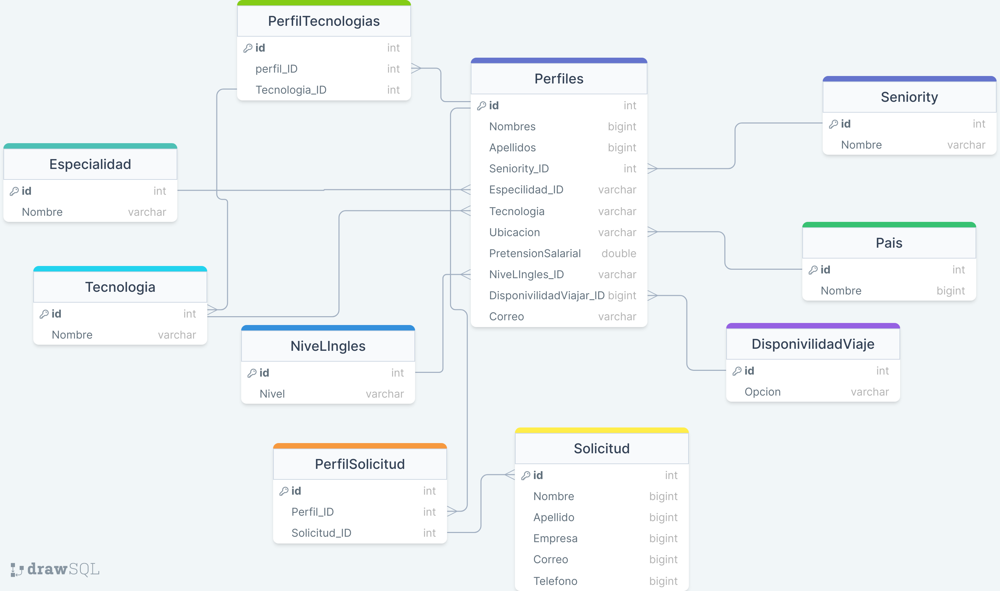

# BackEnd-SideProject
Proyecto Fullstack para Campuslands en 10 Dias

### Diagrama de la base de datos



---

### Migraciones
Crear
```Terminal
dotnet ef migrations add InitialCreate --project ./Persistencia/ --startup-project ./API/ --output-dir ./Data/Migrations/
```

Actualizar
```Terminal
dotnet ef database update --project ./Persistencia/ --startup-project ./API/  
```
---

### Consultas

Repository


---